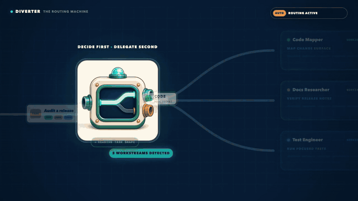

<p align="center">
  
</p>

<h1 align="center">Diverter</h1>

<p align="center">
  <a href="README.md">English</a> | <a href="README.zh.md">简体中文</a>
</p>

<p align="center">
  <a href="LICENSE"></a>
  <a href="https://github.com/openai/codex"></a>
  <a href="https://github.com/GML-MMGroup/Diverter/stargazers"></a>
</p>

<p align="center">
  
</p>

Diverter distills Ultra's delegation strategy into non-Ultra Codex sessions: when a task benefits from specialist help, the main thread keeps moving while the right native subagent handles the independent work.

## Why Diverter

- **Ultra-inspired delegation without Ultra.** Bring task splitting, specialist routing, and result integration to non-Ultra Codex sessions.
- **No manual agent choreography.** Diverter decides when specialist help is useful and which role fits.
- **Keep the main thread moving.** Specialists handle independent work while simple tasks stay simple.

## ✨ See Diverter in action

<p align="center">
  
  <br>
  <sub>A release audit splits across specialists, then returns through the same guardrails.</sub>
</p>

## 🚀 Quick Start

**Diverter requires Codex CLI `0.145.0` or later for native subagent support.**

1. Tell Codex:

   ```text
   Fetch and follow instructions from https://raw.githubusercontent.com/GML-MMGroup/Diverter/refs/heads/main/.codex/INSTALL.md
   ```

2. After installation, open `/hooks`, review and trust Diverter's `SessionStart` Hook, then start or reopen a task.

3. During installation, choose `auto` (recommended) for proactive dispatch or `ask` for approval-first dispatch. Inspect or change the user-level policy with:

   ```text
   $diverter-mode status
   $diverter-mode auto
   $diverter-mode ask
   ```

## 🎯 How Diverter helps

Diverter looks for work that benefits from a specialist, then keeps the main task moving while that specialist handles an independent deliverable.

- Your selected skill keeps control of its workflow and gets focused help only when it adds value.
- Clear write boundaries keep independent changes moving and serialize overlapping work.
- The main thread checks and integrates specialist results into one coherent answer.

When Codex already owns native proactive delegation, Diverter silently steps aside. See OpenAI's [subagent documentation](https://learn.chatgpt.com/docs/agent-configuration/subagents).

Verified with 60+ automated tests and real native subagent lifecycle runs.

## 🧭 Choose your delegation policy

<table align="center">
  <thead>
    <tr>
      <th align="center">Policy</th>
      <th align="center">Behavior</th>
    </tr>
  </thead>
  <tbody>
    <tr>
      <td align="center"><code>ask</code></td>
      <td>Proposes one lineup and waits for approval before dispatching</td>
    </tr>
    <tr>
      <td align="center"><code>auto</code></td>
      <td>Announces one lineup and dispatches it immediately for any Work Mode</td>
    </tr>
  </tbody>
</table>

Policy changes apply at the next `SessionStart`; restarting or reopening the task is the predictable way to apply one. `auto` changes dispatch authorization, not Codex permissions, sandboxing, or handoff write boundaries.

## 🎭 Roles

Diverter includes ten Bundled Subagents. The installer offers the recommended set (`code-mapper`, `docs-researcher`, `reviewer`, `security-auditor`, `test-engineer`, and `test-automator`), all roles, or a custom selection.

| Role | GPT-5.6 model | Reasoning effort | What it does |
|---|---|---|---|
| `code-mapper` | `gpt-5.6-terra` | `high` | Traces code paths, symbols, and ownership boundaries |
| `search-specialist` | `gpt-5.6-luna` | `medium` | Gathers focused repository or external evidence |
| `docs-researcher` | `gpt-5.6-luna` | `high` | Verifies official APIs, versions, and guarantees |
| `knowledge-synthesizer` | `gpt-5.6-luna` | `high` | Reconciles long or conflicting findings |
| `task-distributor` | `gpt-5.6-sol` | `medium` | Splits broad goals into bounded work packages |
| `reviewer` | `gpt-5.6-sol` | `medium` | Reviews correctness, regressions, and maintainability |
| `security-auditor` | `gpt-5.6-sol` | `high` | Audits trust boundaries, secrets, and agent-tool safety |
| `test-engineer` | `gpt-5.6-luna` | `xhigh` | Designs minimal test coverage for behavior and risk |
| `test-automator` | `gpt-5.6-terra` | `xhigh` | Adds bounded regression tests after behavior is clear |
| `web-performance-auditor` | `gpt-5.6-luna` | `xhigh` | Audits Web performance evidence and Core Web Vitals risks |

Diverter selects capabilities first, then maps them to the native roles installed in your Codex environment. Custom role sets can adapt [`role-lineups.md`](skills/diverter/references/role-lineups.md).

## 🔄 Work Modes

| Work Mode | Boundary |
|---|---|
| `read-only` | Inspect and report; never write files |
| `mixed` | Investigate first, then perform bounded writes with explicit artifact ownership |
| `write-capable` | Edit only within the explicit handoff and sandbox |

Diverter always names one Work Mode before dispatch.

## ⚙️ How It Works

1. The `SessionStart` Hook loads the user-level Delegation Policy and activates the Delegation Gate.
2. Diverter identifies a bounded Child Lane, the useful Root Lane that will continue, the Smallest Sufficient Lineup, and one Work Mode.
3. `ask` waits for approval; `auto` announces and dispatches immediately through native role-specific subagents.
4. Root keeps progressing while every child remains a leaf, then integrates, verifies, and returns the final result.

Related follow-ups return to the same native child, preserving the context it already built.

Every handoff carries an explicit goal, scope, write policy, and verifiable deliverable. See [`delegation-contract.md`](skills/diverter/references/delegation-contract.md) and [`handoff-schema.md`](skills/diverter/references/handoff-schema.md).

Diverter matches the user's language. Role names and Work Mode tokens remain in English.

## 🙏 Acknowledgments

- The always-on gate and session-bootstrap pattern was inspired by [obra/superpowers](https://github.com/obra/superpowers).
- The bundled role pack is a curated adaptation of [VoltAgent/awesome-codex-subagents](https://github.com/VoltAgent/awesome-codex-subagents).
- Review, security, test, and Web performance role design was informed by [addyosmani/agent-skills](https://github.com/addyosmani/agent-skills).

## 🤝 Contributing & License

Issues and pull requests are welcome. Useful contributions improve task-shape rules, role mappings, positive and negative examples, or eval scenarios. A good new rule includes both a prompt that should trigger delegation and a similar prompt that should stay focused.

Start with [`decision-rules.md`](skills/diverter/references/decision-rules.md), [`role-lineups.md`](skills/diverter/references/role-lineups.md), and [`evals/scenarios.md`](evals/scenarios.md).

This project is released under the [MIT License](LICENSE).
